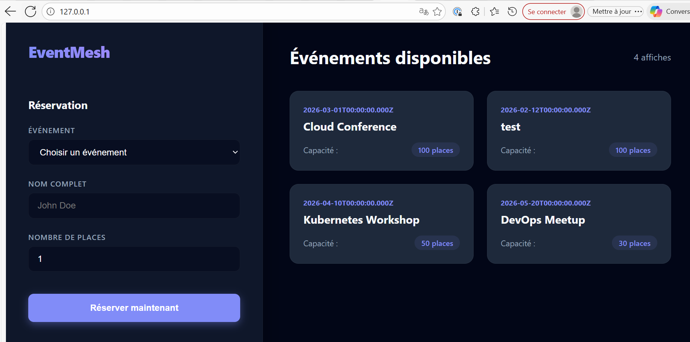
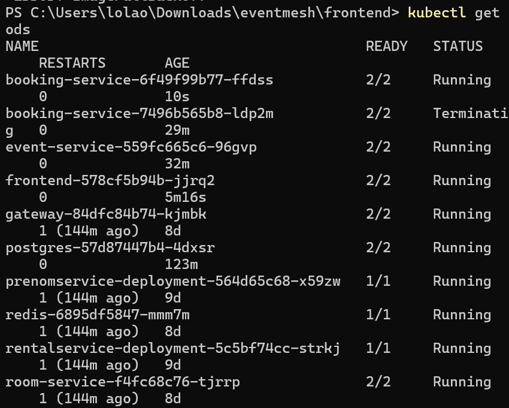
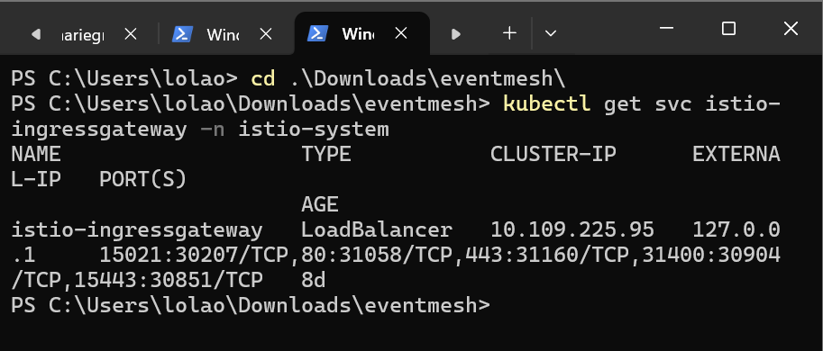
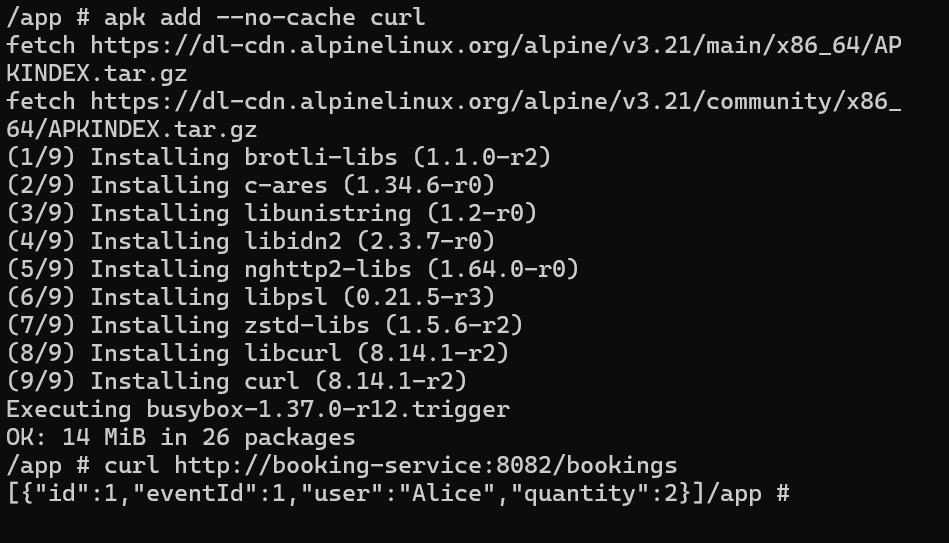

# EventMesh Projet Conteneurisation & Virtualisation

## 1. Objectif du projet

EventMesh est une application **microservices** utilisée comme support technique pour démontrer l’utilisation de :

- Docker (conteneurisation)
- Kubernetes (orchestration et virtualisation applicative)
- Réseau virtualisé Kubernetes (Service + DNS)
- Stockage persistant (PersistentVolumeClaim)
- Exposition réseau via proxy (Istio Ingress Gateway)

Le but du projet est **l’infrastructure cloud-native**, et non la complexité fonctionnelle de l’application.

## 2. Architecture générale

```
Client Web (Navigateur)
        |
        v
Istio Ingress Gateway (proxy)
        |
        +--> Frontend (React + Nginx)
        |
        +--> Event Service (Node.js / Express)
        |
        +--> Booking Service (Node.js / Express)
                     |
                     v
               PostgreSQL (PVC)
```

Tous les composants sont exécutés sous forme de **conteneurs Docker** orchestrés par **Kubernetes**.

## 3. Prérequis

### 3.1 Système

- Windows 10 / 11 (testé)
- Docker Desktop configuré en **Linux containers**

### 3.2 Outils requis

- Docker Desktop
- kubectl
- Minikube
- Git

Vérification :

```bash
docker --version
kubectl version --client
minikube version
```

## 4. Installation du projet

### 4.1 Clonage du dépôt

```bash
git clone <URL_DU_REPO>
cd eventmesh
```

Structure attendue :
```
eventmesh/
├── frontend/
├── event-service/
├── booking-service/
├── k8s/
└── README.md
```

## 5. Démarrage du cluster Kubernetes

```bash
minikube start
```

Vérification :
```bash
kubectl get nodes
```

## 6. Déploiement de l’application

Depuis la racine du projet :
```bash
kubectl apply -f k8s/
```

Vérifier :
```bash
kubectl get pods
kubectl get services
kubectl get pvc
```

Tous les pods doivent être à l’état `Running` et le PVC PostgreSQL à l’état `Bound`.

## 7. Exposition de l’application (Windows)

Sur Windows avec Docker Desktop :
```bash
minikube tunnel
```

Le terminal doit rester ouvert.

Accès :
```
http://127.0.0.1
```

## 8. Initialisation de la base de données

### 8.1 Accès à PostgreSQL

```bash
kubectl get pods
kubectl exec -it postgres-XXXXX -- psql -U admin -d eventdb
```

### 8.2 Insertion des événements

```sql
INSERT INTO events (title, date, capacity) VALUES
('Cloud Conference', '2026-03-01', 100),
('Kubernetes Workshop', '2026-04-10', 50),
('DevOps Meetup', '2026-05-20', 30);
```

Vérification :
```sql
SELECT * FROM events;
\q
```

## 9. Test fonctionnel

1. Ouvrir `http://127.0.0.1`
2. Vérifier l’affichage des événements
3. Sélectionner un événement
4. Entrer un nom et un nombre de places
5. Cliquer sur **Réserver**

## 10. Tests techniques (réseau Kubernetes)

### 10.1 APIs via Ingress

- `http://127.0.0.1/api/events`
- `http://127.0.0.1/api/bookings`

### 10.2 Communication inter-services

```bash
kubectl exec -it event-service-XXXXX -- sh
apk add --no-cache curl
curl http://booking-service:8082/api/bookings
curl http://event-service:8081/api/events
exit
```

Ces tests prouvent le fonctionnement du **DNS interne Kubernetes** et du **réseau virtualisé**.

## 11. Persistance des données (PVC)

```bash
kubectl exec -it postgres-XXXXX -- psql -U admin -d eventdb -c "SELECT count(*) FROM events;"
```

Redémarrer le pod PostgreSQL :
```bash
kubectl delete pod postgres-XXXXX
kubectl get pods
```

Vérifier à nouveau :
```bash
kubectl exec -it postgres-NEWXXXXX -- psql -U admin -d eventdb -c "SELECT count(*) FROM events;"
```

Les données doivent être conservées.

## 12. Nettoyage

```bash
kubectl delete -f k8s/
minikube stop
```

## 13. Captures d’écran

### Interface utilisateur



### État du cluster Kubernetes



### Exposition via Istio Ingress Gateway



### Communication inter-services (DNS Kubernetes)



## 14. Résumé technique

- Docker : conteneurisation
- Kubernetes : orchestration et virtualisation applicative
- Services : réseau virtuel + DNS
- PVC : persistance des données
- Istio : proxy et exposition réseau
- Architecture microservices Node.js

## 15. Conclusion

Ce projet permet à toute personne clonant le dépôt d’installer, déployer et tester une application microservices complète sur Kubernetes, en appliquant les concepts fondamentaux de conteneurisation et de virtualisation.

## Auteur

OKRY Marie-Grâce
